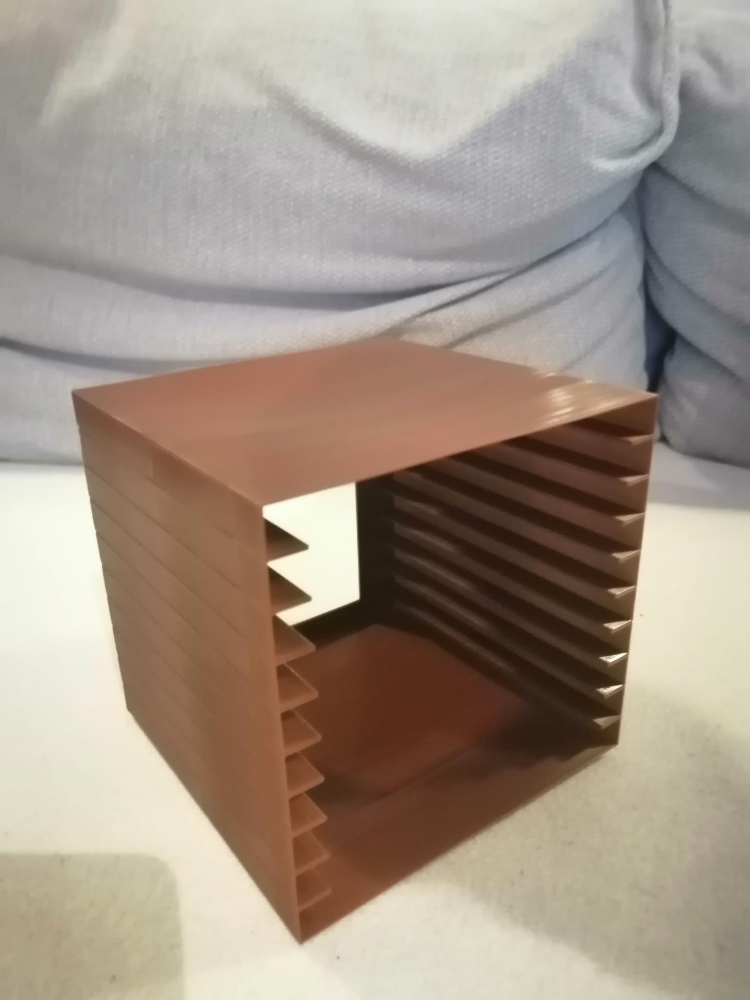
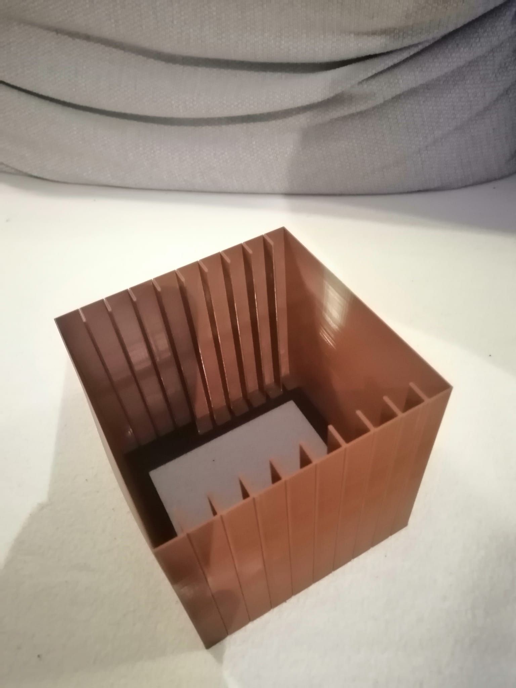

# CD Shelf

A simple CD rack optimized for vase mode

## Print settings

- 0.4 nozzle;
- 0.6 line width (if you change this, you need to generate a new stl!);
- 0.9 bottom thickness;
- 15mm/s first layer speed;
- 30mm/s print speed;
- spiralized outer contour (vase mode);

## Result (PLA)

Printed on Ender3 Pro, 190º/60ºC, GST3D brown PLA

